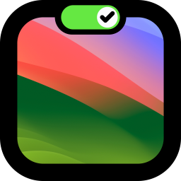
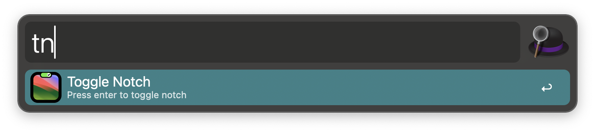

    

# Toggle Notch - An Alfred workflow

Turn the [notch](https://www.theverge.com/2021/10/18/22732912/apple-macbook-pro-notch-display) on Apple Silicon based MacBook on or off quickly. This workflow is essentially a wrapper of an apple shortcut to invoke [Say No to Notch](https://apps.apple.com/app/say-no-to-notch/id1639306886)'s shortcut component.

## Features

This workflow has one single feature: turning the "notch" ON or OFF.

## Pre-requisites

You don't need to do anything to start using this workflow, since it will prompt you install the following pre-requisites for your first run.

- Mac App Store App: [AppStore - Say No To Notch](https://apps.apple.com/app/say-no-to-notch/id1639306886)
- Apple Shortcut: `toggleNotch` 

## Usage

- <kbd>⏎</kbd>: Toggle 'notch' on or off
- <kbd>⌥</kbd><kbd>⏎</kbd>: Turn on notch
- <kbd>⌃</kbd><kbd>⏎</kbd>: Turn off notch

## Todo

- Add hotkey activation.

